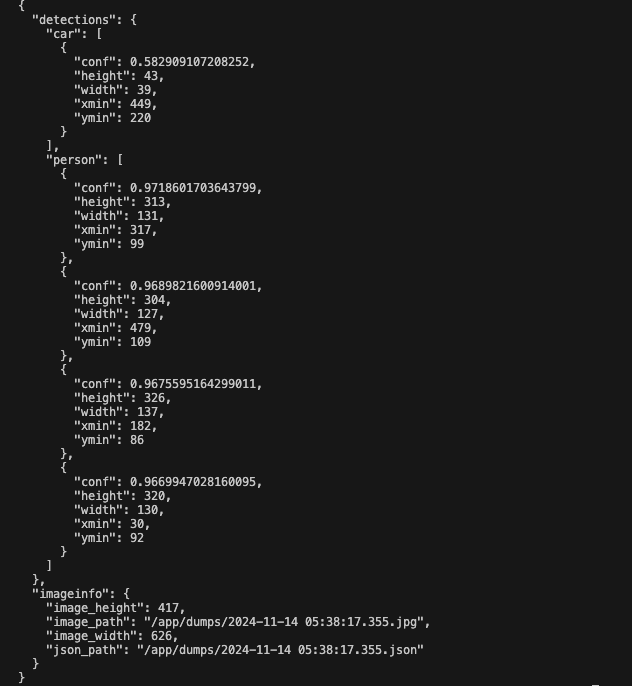
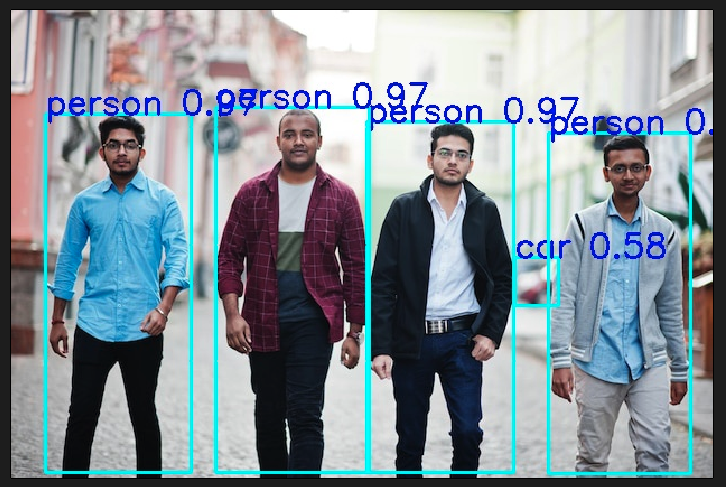

# object-detections

1. Object Detection Overview 
2. ⁠Class and function details
3. ⁠Model convertions
4. ⁠Requirements (gpu,model)
5. ⁠Build steps 
6. ⁠Run steps 
7. ⁠Test steps 
8. ⁠Technical tools
9.  Improvement 
10. ⁠References


## Object Detection Overview 

This codebase is structured for object detection using computer vision algorithms with `GPU` based, with the `YOLOv7` model currently integrated. It accepts input through a `REST API` along with an image, and provides output in the form of a `JSON` data containing detection details, an image with bounding boxes drawn, and saves the JSON file to a specified directory.

The codebase is designed with an `object-oriented` approach, allowing for easy integration of other YOLO versions or models in the future.

Additionally, the codebase supports scaling and can accommodate further use cases. A simple object-counting use case is currently implemented, and an event-based approach is supported, enabling event triggers based on specific use cases.


## ⁠Class and functions details

`App` class is designed as the main handler class. It can create a singleton instance, process images, and perform analytics based on specific use cases.

`Detector` is an abstract class that defines key methods and variables. New model classes can be created and integrated by extending this Detector class.

`YoloV7` is a model class where the YOLOv7 model is integrated for object detection.

`Utils` is a namespace containing utility functions used throughout the codebase.

`inference` is a threaded function that runs in the background, processing images whenever payload data is available in the queue.

`memoryInit` is a function that initializes host and device memory.

`createEngine` is responsible for creating an engine based on model integration requirements.

`loadEngine` loads the previously created engine for use.


## ⁠Model convertions

First clone this repository.

`git clone https://github.com/WongKinYiu/yolov7.git`

`cd yolov7`

Download the yolov7.pt model.

`mv yolov7.pt yolov7`

Here I'm convertine wih NMS nad dynamic batch
command:

`python3 export.py --weights yolov7.pt  --grid --include-nms --conf-thres 0.01 --iou-thres 0.4 --img-size 640 640 --simplify --dynamic-batch --end2end`

Will get a `yolov7.onnx` file, keep it save will require later.

Or you can download the converted model from this [link](https://drive.google.com/file/d/1o8me10N67QZz5yjyl--g31Yl8lYgd7bu/view?usp=sharing).


## ⁠Requirements

```
OS: linux
GPU: Minium Nvidia 1050ti
CUDA Version: Minimum 11.4
Docker
curl
zip
unzip
```

## ⁠Build steps

clone project

`git clone https://github.com/AMIYAMAITY/object-detections.git`

`cd object-detections`

copy that `yolov7.onnx` model file to `models` folder

`sudo docker build -f docker/Dockerfile -t custom:object-detections .`


## ⁠Run steps 

`sudo docker stop object_detections; sudo docker rm  object_detections; sudo docker run -it --rm --network=host --name=object_detections  -p 5000:5000 -v $PWD/dumps:/app/dumps custom:object-detections`

Wait a minute to create the engine

## ⁠⁠Test steps 

`curl -F "file=@./images/group.jpg" http://127.0.0.1:5000/upload`

After this executaion you may see below snapshots





Drawn image and json file will dump in `dumps` folder.


## Technical tools

```
Docker
CUDA
TensorRT
yolov7
c++
crow
python3
flask

```

## Improvement

```
More usecase add
Image resize move CPU to GPU
Will add more input supports like RTSP stream using ffmpeg,gstreamer
Will add more detections algorithms
```
 
## ⁠References

[https://github.com/WongKinYiu/yolov7](https://github.com/WongKinYiu/yolov7)

[https://github.com/wang-xinyu/tensorrtx](https://github.com/wang-xinyu/tensorrtx)

[https://stackoverflow.com/questions/32264709/convert-the-base64string-or-byte-array-to-matimage-in-copencv](https://stackoverflow.com/questions/32264709/convert-the-base64string-or-byte-array-to-matimage-in-copencv)

[https://chatgpt.com/](https://chatgpt.com/)

